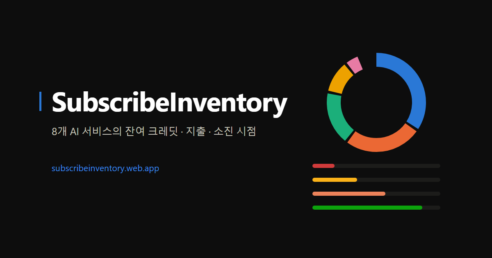

# SubscribeInventory — AI 구독 서비스 잔액 대시보드

[](https://github.com/keaunsolNa/SubscribeInventory/actions/workflows/deploy.yml)

**10개 AI 서비스의 잔여 크레딧 · 할당량 · 이번 달 사용액을 한 화면에서.**
이번 달 지출 구성과 "무엇이 먼저 바닥나나"까지 계산합니다. 키는 브라우저에만 저장되고(BYOK),
잔액이 임계값 아래로 내려가면 Slack으로 알려줍니다.

**▶ 바로 사용하기: https://subscribeinventory.web.app** (무료, Google 로그인)



## 특징

- **10개 서비스 통합 조회** — ElevenLabs · xAI(Grok) · OpenAI · Anthropic(Claude) · DeepSeek ·
  OpenRouter · Stability AI · fal.ai · Kimi(Moonshot) · SiliconFlow (전부 실키로 응답 스키마 검증)
- **BYOK (Bring Your Own Key)** — 키는 브라우저 localStorage에만 저장. 서버는 요청별로 중계만
  하고 저장·로깅하지 않습니다. 코드가 공개되어 있으니 직접 확인하세요.
- **추이 스파크라인 + 소진 예측** — 시간별 히스토리를 쌓아 최근 7일 추이와
  "이 속도면 N일 후 소진"을 카드에 표시. 잔액 그래프는 0을 기준선으로 그리므로
  선의 높이가 곧 남은 양이고, 변화가 미미하면 추세로 부풀리지 않습니다.
- **이번 달 지출 구성** — 프로바이더별 지출 비중. 후불 서비스는 API가 주는 월 누적값을
  그대로 쓰고, 선불 서비스는 관측된 잔액 감소분을 합산하므로 정확도가 다른 항목을 구분해
  표시합니다. **단위가 다른 서비스(크레딧·문자 수)는 합산에서 제외하고 그 사실을 화면에 밝힙니다.**
- **소진 전망** — 무엇이 먼저 바닥나는지 순위. **"남은 일수"로 정규화**하기 때문에
  크레딧·문자 수·달러가 한 축에서 비교됩니다. 두 패널 모두 표 뷰를 제공합니다.
- **Slack 잔여량 알림** — 웹훅+임계값 구독 시 매시 자동 점검. 구독 정보는 AES-256-GCM 암호화
  저장(키 지문 태깅으로 무중단 키 회전 지원)
- **서비스별 잔액 확인 가이드** — 각 서비스의 콘솔·API 확인법과 키 스코프 함정 정리:
  [guides](https://subscribeinventory.web.app/guides/)

## 아키텍처

```
[브라우저]                    [Firebase Hosting]        [Spring Boot @ Cloud Run (서울)]
대시보드(정적 HTML)  ──────▶  전 트래픽 rewrite  ──────▶  키 중계(무저장) · 60초 캐시 · JWT 인증
키·설정: localStorage                                      │
                                                          ├─▶ 10개 AI 서비스 API
[Cloud Scheduler] ── 매시 알림 스윕 / 주간 리포트 ─────────┤
[Cloud Billing → Pub/Sub] ── 예산 알림 ────────────────────┤
                                                          └─▶ Firestore (암호화 구독·히스토리)
[GitHub Actions] ── main 푸시 → 테스트 → WIF 키리스 배포
```

## 서비스별로 얻는 데이터 (실키 검증 완료)

| 서비스 | 엔드포인트 | 지표 | 비고 |
|---|---|---|---|
| ElevenLabs | `GET /v1/user/subscription` (`xi-api-key`) | 잔여 글자 수 | 일반 키 가능 |
| xAI (Grok) | `GET /v1/billing/teams/{teamId}/postpaid/invoice/preview` (Management 키) | 선불 잔액 | `prepaidCredits − prepaidCreditsUsed`, 센트 문자열·음수. `prepaid/balance`는 콘솔과 불일치라 미사용 |
| OpenAI | `GET /v1/organization/costs` (**Admin 키**, `api.usage.read`) | 월 사용액 | 잔액 API 미제공 |
| Anthropic | `GET /v1/organizations/cost_report` (**조직 Admin 키**) | 월 사용액 | 개인 계정은 조직 구성 선행 |
| DeepSeek | `GET /user/balance` (Bearer) | 선불 잔액 | 일반 키 가능 |
| OpenRouter | `GET /api/v1/credits` (Bearer) | 크레딧 | `total_credits − total_usage` |
| Stability AI | `GET /v1/user/balance` (Bearer) | 크레딧 | 일반 키 가능 |
| fal.ai | `GET /v1/account/billing?expand=credits` (`Key` 스킴) | 크레딧 | **ADMIN 스코프 키 전용** (기본 키는 403) |
| Kimi (Moonshot) | `GET /v1/users/me/balance` (Bearer) | 선불 잔액 | 일반 키 가능. `available_balance` 기준 — `cash_balance`는 음수 가능. `platform.kimi.ai`/`.com` 키 비호환 |
| SiliconFlow | `GET /v1/user/info` (Bearer) | 선불 잔액 | 일반 키 가능. `totalBalance`, 문자열. **응답에 통화 없음** — `.cn`=CNY / `.com`=USD |

> **아직 넣지 못한 서비스** (2026-08 기준) — Gemini·Groq는 잔액/사용량 조회 공개 API를 찾지
> 못했습니다. Perplexity는 브라우저 쿠키 세션이 필요한 비공개 엔드포인트뿐이라 BYOK 구조에
> 맞지 않고, Mistral은 콘솔 관리 API로 월 지출만 조회됩니다. Leonardo.ai는 잔액 엔드포인트가
> 있지만 API 이용에 결제수단 등록이 필요하고 공식 응답 스키마를 확인하지 못해 보류했습니다.
> 각 함정의 상세 설명은 [서비스별 가이드](https://subscribeinventory.web.app/guides/)에 있습니다.

## API

- `GET /api/health` — 헬스체크 (항상 개방)
- `POST /api/usage` — BYOK 조회: `{"keys":{"xai":{"apiKey":"...","teamId":"..."}, ...}}`
- `POST /api/usage/history` — 최근 7일 시간별 히스토리 (스파크라인용)
- `POST /api/usage/monthly` — 이번 달 프로바이더별 잔액 소비량. 관측 구간과 샘플 수를 함께
  반환하므로 기록이 없는 구간을 "지출 0"으로 오해하지 않습니다. 월 누적 지출을 그대로 주는
  후불 서비스(OpenAI·Anthropic)는 여기서 계산하지 않습니다 — 라이브 값이 더 정확합니다.
- `POST /api/alerts/subscriptions` / `DELETE .../{id}` — Slack 알림 구독·해지
  (payload 전체 AES-256-GCM 암호화, 웹훅은 `hooks.slack.com` 프리픽스만 허용)
- `GET /` — 대시보드, `GET /guides/` — 서비스별 가이드

한 서비스가 실패해도 나머지는 정상 반환됩니다(ERROR 카드 격리).

## 보안 설계

- **인증 3모드** (`AuthFilter`): Google 로그인(ID 토큰 → 자체 JWT 7일, 구독은 소유자 귀속) /
  공유 토큰 / 개방(로컬). 기계 호출(Scheduler·Pub/Sub push)은 별도 토큰 경로.
- **캐시 키 = 자격증명 SHA-256 지문** — 사용자 간 격리, 평문 키 미보관 (60초 TTL)
- **히스토리에는 수치만** — 프로바이더별 잔액 숫자와 비가역 지문만 저장, 키는 절대 저장 안 함
- **암호화 키 회전** — 암호문에 키 지문 태그를 붙여 `ENCRYPTION_OLD_KEYS`로 무중단 회전 가능

## 로컬 실행

```bash
# 키 없이 실행 → 대시보드 키 패널(BYOK)로 조회
mvn spring-boot:run          # http://localhost:8080

# 셀프호스팅: 환경변수로 서버에 키 주입 (필요한 것만)
ELEVENLABS_API_KEY=... OPENAI_ADMIN_KEY=... mvn spring-boot:run
```

## 배포

main에 푸시하면 GitHub Actions가 테스트(124개) 후 Workload Identity Federation(키리스)으로
Cloud Run에 자동 배포합니다 (`.github/workflows/deploy.yml`). 수동 배포:

```bash
gcloud run deploy subscribe-inventory --source . --region asia-northeast3 --allow-unauthenticated
```

선택 환경변수: `GOOGLE_CLIENT_ID`+`JWT_SECRET`(Google 로그인), `ACCESS_TOKEN`(공유 토큰 모드),
`ENCRYPTION_KEY`+`GCP_PROJECT_ID`(Slack 구독·히스토리), `BUDGET_SLACK_WEBHOOK`(예산 알림 릴레이).
공개 배포에는 서버 측 프로바이더 키를 넣지 않습니다(순수 BYOK).

## 라이선스

[Elastic License 2.0](LICENSE) (SPDX: `Elastic-2.0`) — © keaunsolNa

소스는 투명성(키를 다루는 서비스의 신뢰)을 위해 공개돼 있습니다. 열람·수정·재배포와
직접 셀프호스팅해서 쓰는 것 모두 자유롭게 하셔도 됩니다. 다만 **이 소프트웨어를 제3자에게
관리형(호스팅) 서비스로 제공하는 것**과 라이선스·저작권 고지를 제거하는 것은 허용되지 않습니다.

OSI 공인 오픈소스 라이선스는 아닌 source-available 라이선스입니다.

> **License:** Source-available under the [Elastic License 2.0](LICENSE). You may use, modify,
> redistribute, and self-host this software freely. You may **not** provide it to third parties
> as a hosted or managed service. Not an OSI-approved open source license.
